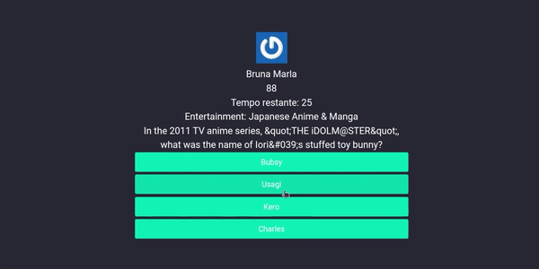

# Jogo Trivia
## Sobre o projeto

Foi desenvolvido um jogo de perguntas e respostas baseado no jogo Trivia (tipo um show do milhão americano rs) utilizando React e Redux, desenvolvendo em grupo suas funcionalidades de acordo com as demandas definidas em um quadro Kanban. 

Trabalhamos em equipe utilizando metodologias ágeis como Trello, Slack e Zoom para desenvolver nossas habilidades de colaboração. Além disso, realizamos reuniões diárias de 10 minutos para definir as tarefas do dia e utilizamos o Git para o versionamento de código.

### Colaboradores:

1. [Bruna Almeida](https://www.linkedin.com/in/bruna-almeida-soares);
2. [Leandro Batista](https://www.linkedin.com/in/leandrobatistac/);
3. [Giovana Gabriela Zupiroli](https://www.linkedin.com/in/giovanazupiroli/);
4. Lívia Fernanda;
5. Lucas Teixeira;
6. Leonardo Vinicius Carlota;

### Habilidades desenvolvidas:

- Criar um store Redux em aplicações React

- Criar reducers no Redux em aplicações React

- Criar actions no Redux em aplicações React

- Criar dispatchers no Redux em aplicações React

- Conectar Redux aos componentes React

- Criar actions assíncronas na sua aplicação React que faz uso de Redux.

- Escrever testes para garantir que sua aplicação possua uma boa cobertura de testes.

### Linguagens utilizadas:

- React
- Redux
- CSS

### Biblioteca Utilizada:

- Bulma

### Layout



## Como executar:
 
 ```bash
 # clone o repositorio
 
- git clone git@github.com:bruna270498/trivia.git

# Instale as dependências

- npm install.

# Rode o comando

- npm start

```
